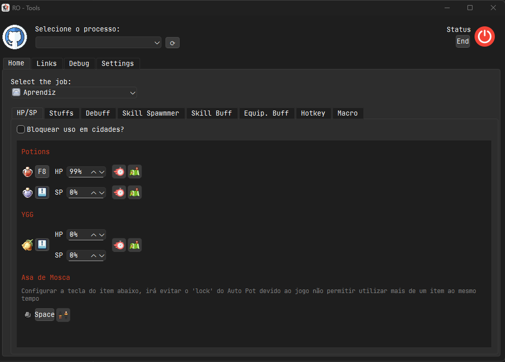

<h1 style="display:flex; align-items: center; gap: 1rem;">
  
  <span>RO - Tools</span>
</h1>

---

## 📦 Download

Você pode baixar a versão mais recente do RO Tools clicando no botão abaixo:

[](https://github.com/uniaodk/ro-tools/releases/download/v1.0.0/RO_Tools_v1.0.0.zip)

## 🎮 Visão Geral

Ferramenta de automação para jogadores de **Ragnarok Online** focada em buffs, uso de itens automáticos, execução de macros e habilidades.

O RO-Tools foi criado para facilitar a jogabilidade em servidores de Ragnarok Online (pré-renovação). Ele automatiza ações como uso de poções, buffs, macros e alternância de equipamentos com base em condições personalizadas.


## 📸 Interface Principal



### Componentes da Interface

#### 🔌 Processo

- Selecione o processo do jogo para ativar os eventos. O botão 🔁 (refresh) atualiza a lista de processos abertos.

#### 🔧 Abas

- **Início**: Painel de controle principal com eventos ativos.
- **Links**: Acesso rápido a páginas úteis.
- **Configurações**: Ajustes da aplicação.

#### 🧪 Auto Item

Automatiza o uso de itens com base em condições personalizadas. Pode ser usado para restaurar HP/SP, aplicar efeitos de buff ou remover debuffs automaticamente. Inclui também configurações para itens especiais como Yggdrasil e Asa de Mosca.

- 💉 **Potions**
  - Usa poções configuradas com base em percentual de HP e SP.
  - Suporte a múltiplas teclas configuráveis.

- 🌿 **YGG**
  - Usa automaticamente sementes ou frutas de Yggdrasil ao atingir limiares críticos de HP/SP.

- 🧪 **Itens de Buff**
  - Aplica consumíveis que fornecem efeitos de buff (ex: Poção de Concentração, Poção de Despertar).
  - Pode ser configurado por tecla e tempo de recarga.

- 💀 **Itens para Curar Debuff**
  - Usa itens que removem efeitos negativos automaticamente (ex: Panaceia, Poção Verde).
  - Pode ser configurado para remover tipos específicos de status (Silêncio, Cegueira, etc).

- 🦋 **Asa de Mosca**
  - Configura uma tecla dedicada para o uso da Asa de Mosca, evitando conflito com o sistema de Auto Pot.
  - Necessário devido à limitação do jogo de usar apenas um item por vez.

#### 🧰 Job Tools

Ferramentas específicas por profissão.

- **Skill Spawmmer**: Repetição de habilidades ofensivas.
- **Skill Buff**: Ativação periódica de buffs.
- **Equip. Buff**: Troca de equipamento para ativar efeitos.
- **Hotkey**: Execução de comandos por atalho.
- **Macro**: Sequência de ações automatizadas.

---

## ⚙️ Eventos Disponíveis

Abaixo a lista de eventos definidos no sistema:

| Evento              | Descrição |
|---------------------|-----------|
| `auto_item_buff`    | Aplica itens que fornecem efeitos de buff automaticamente. |
| `auto_item_debuff`  | Usa itens que removem debuffs automaticamente. |
| `auto_pot_hp`       | Usa potions com base em percentual de HP. |
| `auto_pot_sp`       | Usa potions com base em percentual de SP. |
| `auto_ygg`          | Usa sementes ou frutas de Yggdrasil conforme necessário. |
| `hotkey_event`      | Executa ações com base em teclas de atalho personalizadas. |
| `macro_event`       | Executa sequências personalizadas de ações (macros). |
| `skill_buff`        | Aplica automaticamente habilidades de buff conforme a lista de buffs do personagem. |
| `skill_equip`       | Troca de equipamento com base na ativação de skills. |
| `skill_spawmmer`    | Automatiza o uso de habilidades ofensivas. |
| `base_event`        | Classe base que define estrutura comum a todos os eventos. |
| `game_event`        | Controla execução e sincronização dos eventos com o jogo. |

---

## 📁 Estrutura de Pastas

```
ro-tools/
├── assets/ # Ícones e imagens de habilidades
├── config/ # Arquivos de configuração e ícones
├── events/ # Eventos principais que controlam ações automatizadas
├── game/ # Estruturas e lógica de jogo (jobs, buffs, etc)
├── gui/ # Interface gráfica (Qt)
├── service/ # Serviços como teclado, mouse, memória
├── tests/ # Testes automatizados
└── util/ # Utilitários diversos
```

## 🛠 Requisitos

- Python 3.10+
- PyQt6
- pywin32
- keyboard
- pymem
- psutil

Instale as dependências com:

```bash
pip install -r requirements.txt
```

## 🚀 Execução

Para iniciar a aplicação, execute o seguinte comando:

```bash
python main.py
```

---

## 🙏 Agradecimentos e Projeto Base

Este projeto foi desenvolvido com base no excelente trabalho realizado pelo [4RTools](https://github.com/4RTools/4RTools).

Muitos dos conceitos, estruturas e ideias iniciais foram inspirados ou adaptados a partir desse projeto.  
Agradecemos à comunidade do 4RTools por tornar seu código aberto e servir como referência para a evolução de ferramentas voltadas ao Ragnarok Online.

> Este repositório visa expandir e adaptar funcionalidades específicas para o cenário **pré-renovação**, com foco em automações personalizadas e extensibilidade do sistema de eventos.

## ⚠️ Aviso Legal

Esta ferramenta foi desenvolvida para fins educacionais e uso pessoal.

O uso deste software em servidores oficiais de Ragnarok Online pode violar os termos de serviço do jogo.  
**Utilize por sua conta e risco.**
